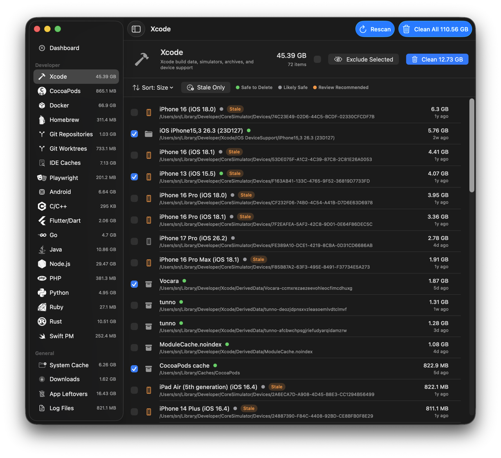

  

<h1 align="center">MegaCleaner</h1>

  <strong>Your dev tools are why your disk is full.</strong> 
  They cache everything and clean up nothing. We scan 29 of them in seconds.

  <a href="https://megacleaner.app">Website</a> &bull;
  <a href="https://megacleaner.app/#download">Download</a> &bull;
  <a href="https://megacleaner.app/contact">Contact</a>

---

<!-- Replace with actual screenshot when available -->

  

---

## Deeper than you think

MegaCleaner goes deeper than generic cleaners — it understands Xcode DerivedData, Docker images, simulator runtimes, orphaned IDE indexes, stale `node_modules`, and dozens of other developer-specific space hogs that other tools miss entirely.

## Features

- **Understands project structures** — Knows what belongs where. Not just file sizes.
- **Detects staleness** — Flags projects untouched for 30+ days.
- **Confidence levels on every item** — Definite, Probable, Possible. You decide what to remove.
- **Shows regeneration commands** — Know exactly how to rebuild anything you delete.

## What it scans

**29 scanners. 90+ sub-features. Every ecosystem.**

| Languages & Frameworks | Developer Tools | System |
|---|---|---|
| Node.js, Python, Rust, Go | Xcode, Docker, Git | System Cache, Downloads |
| Java, Ruby, PHP, C++ | CocoaPods, Homebrew | Trash, Mail, Log Files |
| .NET, Flutter, Swift | Terraform, Android, VS Code | App Leftovers, iOS Backups |
| | Playwright, JetBrains | Browsers (Chrome, Safari, Firefox, Arc) |

## Requirements

- macOS Sonoma or later
- Apple Silicon and Intel supported
- Native Swift app — under 20 MB, no Electron

  <a href="https://megacleaner.app/#download"><strong>Download MegaCleaner</strong></a>

---

  <a href="https://megacleaner.app/privacy">Privacy</a> &bull;
  <a href="https://megacleaner.app/terms">Terms</a> &bull;
  <a href="https://megacleaner.app/contact">Contact</a>
    
  &copy; 2026 MegaCleaner

